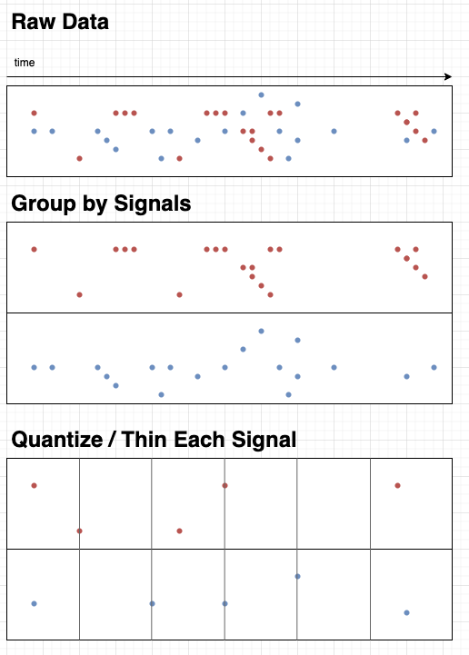

# CLAPTS

*Count Limited and Partitioned Time Series*

A collection for visualizing time series data. It uses a simple heuristic to 
maintain a bounded size and representative sampling while continually receiving
new data points.

Example use case: display realtime driver routes on a ride sharing dashboard.

## 1.0.0 Todos

- [ ] Code Cleanup
- [ ] Docs
- [ ] Demo app with MapBox
- [ ] Profiling and perf (maybe WebAssembly)
- [ ] Better testing (property / fuzz / mutation)
- [ ] Wrap methods with a more dev friendly interface
